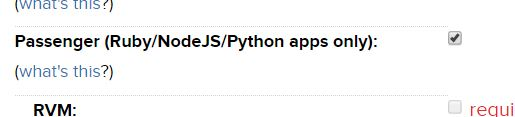

# Setting up flask on Dreamhost with Python 3.5

## Step 1. Connect to your host with ssh

you can use winscp, putty to connect to your host. Make sure user account you are using has ssh access. Otherwise after login putty will automatically close.

## Step 2. Download and install Python

I have used python 3.5.1 for this. It should work with any version

#### 2.1 Create a directory to download python in (Optional)

```
mkdir python
cd python
````

#### 2.2 Install Python

```
wget https://www.python.org/ftp/python/3.5.1/Python-3.5.1.tar.xz
tar xvfJ Python-3.5.1.tar.xz
cd Python-3.5.1
./configure --prefix=$HOME/Python35
make
make install
```

#### 2.3 Create and Activate Virtual Environment

```
cd $HOME/.python3.5.1/bin
./pip3.5 install virtualenv
./virtualenv -p $HOME/.python3.5.1/bin/python3.5 $HOME/venv
cd $HOME/venv
source bin/activate
```

## Step 3. Install Flask

```
easy_install flask
```


## Step 4. Setup Pessenger

#### 4.1 Enable Pessenger
make sure you have pessenger enabled in your dreamhost hosting

Go to your domain/sub domain -> edit -> and check the Passenger checkbox



#### 4.2 Create passenger_wsgi.py
Now Create a file passenger_wsgi.py in your domain or sub-domain's root folder with following 

```
import sys, os
INTERP = os.path.join(os.environ['HOME'], 'venv', 'bin', 'python')
if sys.executable != INTERP:
    os.execl(INTERP, INTERP, *sys.argv)
sys.path.append(os.getcwd())
import datetime

from flask import Flask
application = Flask(__name__)


@application.route('/')
def index():
    return 'Hello Passenger : ' + str(datetime.datetime.now().time())

# Endpoint to check python version	
@application.route('/pyversion')
def pyversion():
	version = str(sys.version_info)
	return version
```


## Setup the server

Add a folder called temp with file restart.txt
```
mkdir temp
touch temp/restart.txt
```

run 'touch temp/restart.txt' again to restart you application

now you should be able to acces your flask application using your domain/subdomain address

